# HelpDesk · Gestión de incidencias

Práctica evaluable 1 · Desarrollo Web en Entorno Servidor · 2.º DAW
**Autor:** _<tu nombre>_

Aplicación de consola para registrar incidencias del centro: crearlas, listarlas, buscarlas, cerrarlas, ver estadísticas y conservarlas entre ejecuciones en `tickets.txt`.

## 1. Requisitos y ejecución

**Requisitos:** JDK 17 o superior y Apache Maven 3.x (JUnit 5 se descarga automáticamente).

Todos los comandos se ejecutan desde la **raíz del proyecto** (la carpeta donde está `pom.xml`):

```bash
# 1. Ejecutar las pruebas automáticas
mvn test

# 2. Compilar y ejecutar la aplicación
mvn compile
java -cp target/classes HelpDesk.AplicacionHelpDesk
```

- La aplicación lee y escribe `tickets.txt` en la carpeta desde la que se lanza, por eso hay que ejecutarla desde la raíz. Si el archivo no existe, arranca con una colección vacía.
- Se entrega un `tickets.txt` de ejemplo con dos incidencias (una abierta y una cerrada).
- `target/` e `.idea/` no se incluyen en el repositorio (excluidos en `.gitignore`).
- Las capturas de la sección 5 se hicieron ejecutando el proyecto desde IntelliJ IDEA; el comportamiento es el mismo con los comandos anteriores.

## 2. Estructura y responsabilidades

```
src/main/java/HelpDesk/   Ticket · GestorTickets · ArchivoTickets · AplicacionHelpDesk
src/test/java/HelpDesk/   TicketTest · GestorTicketsTest · EstadisticasTest · ArchivoTicketsTest
```

| Clase | Responsabilidad |
|---|---|
| `Ticket` | Datos, validación y estado de una incidencia. |
| `GestorTickets` | Colección, identificadores, creación, búsqueda y estadísticas. |
| `ArchivoTickets` | Lectura y escritura de `tickets.txt`. |
| `AplicacionHelpDesk` | Menú, `Scanner`, mensajes y coordinación. |

Cada clase solo conoce a la de debajo: `AplicacionHelpDesk → GestorTickets → Ticket`. Solo la aplicación usa `Scanner` y `System.out`.

## 3. Partes del código que conviene explicar

### 3.1 `Ticket`: el objeto se protege a sí mismo

- Atributos privados; `id` y `descripcion` son `final` y no hay *setters*. Lo único que cambia es `cerrado`, y solo mediante `cerrar()`.
- El constructor valida (id positivo, descripción no nula/vacía/en blanco, sin saltos de línea) y lanza `IllegalArgumentException`. Así **un `Ticket` existente siempre es válido**, lo cree el menú o una prueba.
- Hay dos constructores: el normal (siempre abierto) y otro con estado para reconstruir tickets cerrados desde el archivo. El primero delega en el segundo con `this(...)`, así la validación está en un solo sitio.
- `cerrar()` devuelve `boolean` (`true` si estaba abierto, `false` si ya estaba cerrado) para que la aplicación distinga ambos casos.

### 3.2 `GestorTickets.crearTicket`: no consume el identificador si falla

```java
Ticket nuevo = new Ticket(siguienteId, descripcion); // si falla, lanza excepción aquí
tickets.add(nuevo);
siguienteId++;
```

El `Ticket` se construye **antes** de tocar la lista o el contador. Si la descripción es inválida, la excepción corta el método: no se añade nada y el identificador no se gasta.

### 3.3 `GestorTickets.getTickets`: copia de la lista, mismos objetos

Devuelve `new ArrayList<>(tickets)`. Si alguien vacía o modifica la lista devuelta, el gestor no se entera (protección). Pero los `Ticket` no se clonan: cerrar uno desde fuera sí se refleja en el gestor.

### 3.4 Estadísticas

El cálculo está en el gestor (`totalTickets`, `ticketsAbiertos`, `ticketsCerrados`); la aplicación solo muestra. `ticketsCerrados()` es `total - abiertos` para no duplicar lógica y garantizar que siempre sumen el total.

### 3.5 `ArchivoTickets`: carga "todo o nada"

Formato, una incidencia por línea: `id;cerrado;descripcion`.

- **`split(";", 3)`**: corta solo en los dos primeros `;`; el resto es la descripción, así que puede contener punto y coma.
- **Sin carga parcial**: la lista solo se devuelve al final del bucle. Si cualquier línea es inválida (formato, id no numérico, estado distinto de `true`/`false`, id repetido) se lanza `IOException` con el número de línea.
- **Estado leído a mano** (no `Boolean.parseBoolean`): este devuelve `false` para cualquier texto raro y aceptaría datos corruptos.
- `cargar()` nunca escribe. Si falla, la aplicación no arranca y nadie llama a `guardar()`, por lo que **el archivo no se sobrescribe**.
- Archivo inexistente → colección vacía. Tras cargar, la numeración continúa desde el mayor id + 1. Codificación UTF-8.

### 3.6 `AplicacionHelpDesk`

- **`leerEntero`**: bucle que repite la pregunta hasta que `Integer.parseInt` funciona (requisito de corregir entradas no numéricas).
- Se lee siempre con `nextLine()` para evitar el problema del salto de línea residual de `nextInt()`.
- La aplicación **no valida** descripciones: delega en el gestor y captura la excepción.
- El mensaje de éxito está dentro del `try`, después de la operación que puede fallar, así una operación fallida nunca se presenta como correcta.
- `cerrarIncidencia` distingue tres casos: no existe (`Optional` vacío), cerrada ahora y ya estaba cerrada.
- El menú está dividido en un método por operación; `main` solo arranca la aplicación.

## 4. Pruebas automáticas

Cada prueba prepara sus propios datos, no usa `Scanner` ni depende del orden. Las de persistencia usan `@TempDir`, así que nunca tocan el `tickets.txt` real.

| Clase | Nº | Qué comprueba |
|---|---|---|
| `TicketTest` | 6 | Estado inicial abierto; cierre; cierre repetido; rechazo de descripción en blanco, nula e id cero. |
| `GestorTicketsTest` | 8 | Colección vacía; ids consecutivos; búsqueda del mismo objeto (`assertSame`); búsqueda inexistente; creación inválida sin alterar colección ni contador; protección de la lista interna; numeración desde el mayor id; ids repetidos. |
| `EstadisticasTest` | 3 | Gestor vacío; dos abiertas; dos con una cerrada. |
| `ArchivoTicketsTest` (opcional) | 8 | Archivo inexistente; guardar y cargar conserva datos; punto y coma en descripción; estado inválido; id no numérico; ids repetidos; archivo inválido no se sobrescribe; numeración tras cargar. |


<p align="center">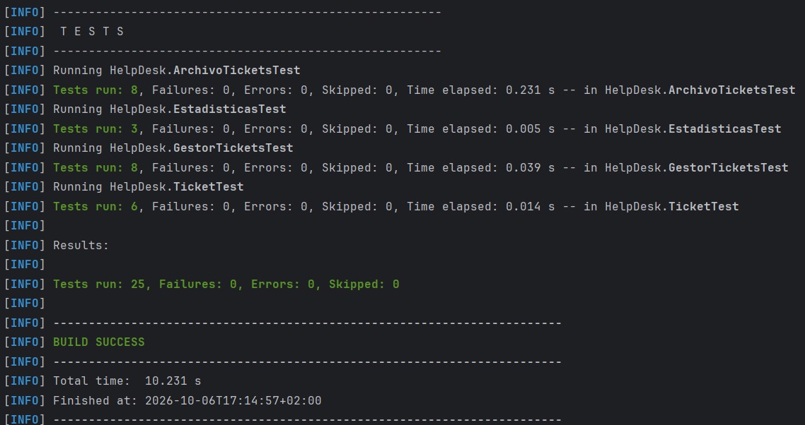</p>


**Pruebas que merece la pena saber interpretar:**

- `creacionInvalidaNoAlteraColeccionNiContador`: crea con descripción en blanco, comprueba que falla y que la lista sigue vacía; luego crea un ticket válido y comprueba que recibe el id 1 (el contador no se consumió).
- `modificarLaListaDevueltaNoAfectaAlGestor`: vacía la copia y comprueba que el gestor conserva su ticket; con `assertSame` comprueba que son los mismos objetos, no clones.
- `archivoInvalidoNoSeSobrescribe`: tras una carga fallida comprueba que el contenido del archivo es idéntico al original.

### Prueba fallida provocada

Se comentó a propósito la línea `cerrado = true;` de `Ticket.cerrar()`.

- **Fallaron:** `cerrarCambiaElEstadoACerrado` y `cerrarDosVecesDevuelveFalseLaSegundaVez`.
- **Por qué:** ambas verifican con `assertTrue(t.estaCerrado())` que el estado cambia; sin esa línea el ticket seguía abierto.
- **Conclusión:** las aserciones detectan el fallo, es decir, las pruebas comprueban el requisito y no solo llaman al método. Después se restauró el código.


<p align="center">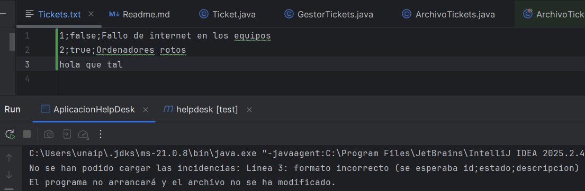</p>


## 5. Demostración

Recorrido obligatorio del enunciado, paso a paso.

### Paso 1 · Inicio sin archivo de datos

La aplicación arranca sin `tickets.txt` y parte de una colección vacía.

<p align="center">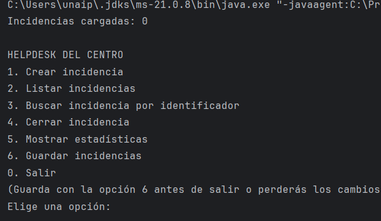</p>

### Paso 2 · Crear dos incidencias válidas

Se crean las incidencias 1 y 2, ambas abiertas.

<p align="center">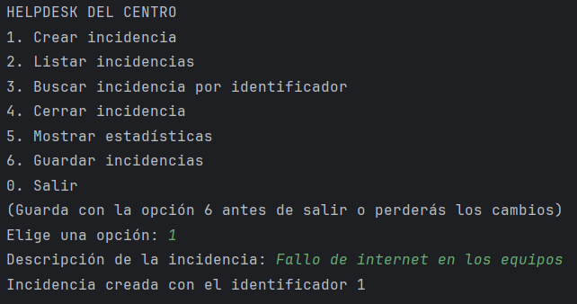</p>

<p align="center">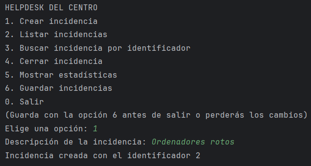</p>

### Paso 3 · Descripción en blanco rechazada

No se crea el ticket y se informa del motivo.

<p align="center">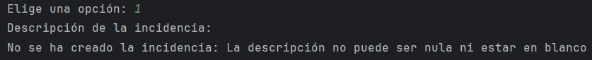</p>

### Paso 4 · Cerrar la segunda incidencia

Se cierra la incidencia 2 y se confirma.

<p align="center">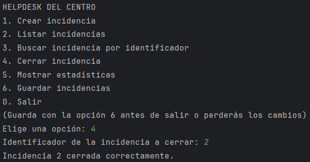</p>

### Paso 5 · Estadísticas

Resultado esperado: 2 totales, 1 abierta y 1 cerrada.

<p align="center">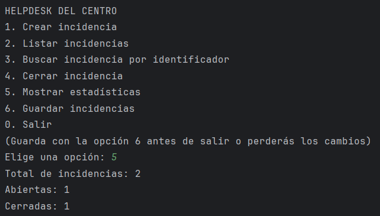</p>

### Paso 6 · Guardar y salir

Se guardan las incidencias con la opción 6 y se sale con la 0.

<p align="center">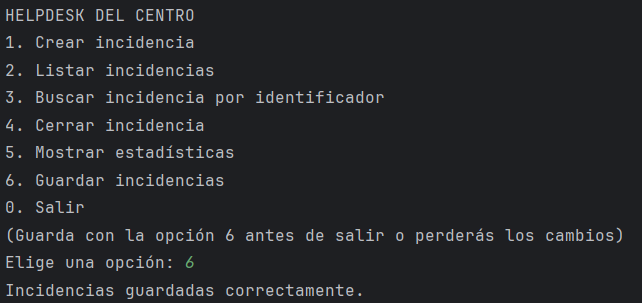</p>

<p align="center">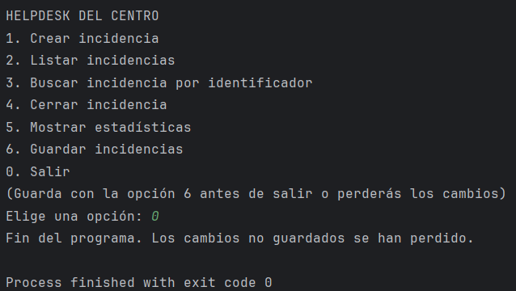</p>

### Paso 7 · Datos conservados tras reiniciar

Al volver a ejecutar, se recuperan las incidencias con su estado.

<p align="center">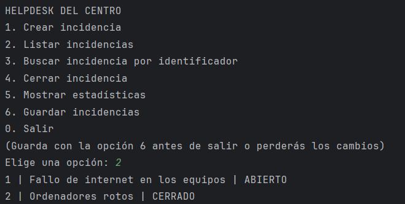</p>


### Paso 8 · Pruebas con Maven

Ver la captura de la sección 4 (*Pruebas superadas*).

### Comprobaciones extra de errores

**Texto en lugar de una opción de menú:** aviso de opción incorrecta y el programa continúa.

<p align="center">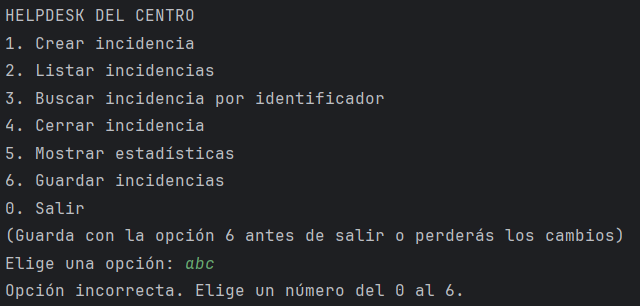</p>

**Texto en lugar de un identificador:** se avisa y se vuelve a pedir.

<p align="center">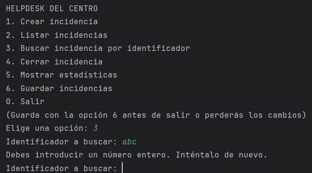</p>

## 6. Limitaciones conocidas

- El guardado es manual (opción 6); lo no guardado se pierde al salir. El menú lo recuerda.
- Las descripciones son de una sola línea.
- Una línea en blanco en `tickets.txt` se considera dato inválido.
- Si el guardado se interrumpe a mitad, el archivo podría quedar incompleto (no se usa archivo temporal).
- La ruta `tickets.txt` es relativa a la carpeta desde la que se ejecuta.

## 7. Historial de Git

El desarrollo se ha hecho de forma incremental, con un commit por cada avance real (de más antiguo a más reciente):

| Nº | Mensaje del commit | Qué aporta |
|---|---|---|
| 1 | Primer commit, proyecto creado | Proyecto Maven, `pom.xml` y `.gitignore`. |
| 2 | Clase Ticket y clase TicketTest creadas | `Ticket` con validaciones y sus 6 pruebas. |
| 3 | Clase GestorTickets y clase GestorTicketsTest creadas | `GestorTickets` (creación, búsqueda, copia de lista, estadísticas) y sus pruebas. |
| 4 | Clase ArchivoTickets y clase ArchivoTicketsTest creadas | Persistencia en `tickets.txt` y sus pruebas. |
| 5 | Clase AplicacionHelpDesk completada | Menú de consola y coordinación de las demás clases. |
| 6 | Clase EstadisticasTest completada y tests comprobados | Pruebas de estadísticas y ejecución de todas las pruebas. |
| 7 | Pruebas de evidencias para documentacion | Carpeta `evidencias/` con las capturas de la demostración. |
| 8 | Tickets.txt donde se guardaran las incidencias | Archivo `tickets.txt` de ejemplo. |

